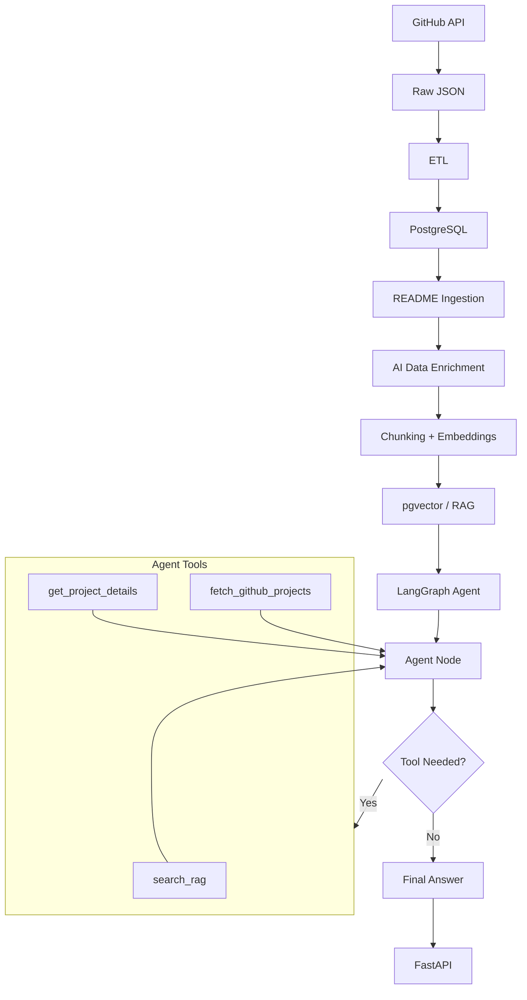

# Open Source Project Intelligence

An AI-powered system for discovering and understanding open-source GitHub projects.

## Overview

This project collects GitHub repository data, processes it with a data pipeline, enriches projects using a local LLM, and provides RAG-based agentic search through an API.

## Architecture



## Features

* GitHub repository ingestion
* Data cleaning and transformation
* PostgreSQL data storage
* LLM-based project enrichment
* Vector search with pgvector
* RAG-based project retrieval
* LangGraph agent with tools
* FastAPI API
* Docker support

## Tech Stack

* Python
* PostgreSQL
* pgvector
* FastAPI
* LangGraph
* Ollama
* Qwen2.5
* Sentence Transformers
* GitHub REST API
* Docker

## Database Setup

1. Create a PostgreSQL database.
2. Enable the pgvector extension.
3. Run database/schema.sql.
4. Configure the database environment variables.
5. Run the ingestion pipeline to populate the database.

## API

Start the API:

```bash
uvicorn src.api.main:app --reload
```

Open:

```text
http://localhost:8000/docs
```

Example request:

```json
{
  "query": "Tell me about AutoGPT"
}
```

Example response:

```json
{
  "answer": "AutoGPT is an AI-driven platform..."
}
```

## Evaluation
### Initial RAG Evaluation

The initial evaluation uses 5 manually curated queries.

| Metric | Score |
|---|---:|
| Hit@1 | 0.80 |
| Hit@3 | 1.00 |
| Hit@5 | 1.00 |
| MRR | 0.867 |

### Agent Evaluation
- Queries: 4
- Tool Accuracy: 0.75

Tested tool routing:
- search_rag
- get_project_details
- fetch_github_projects

The evaluation also tests multi-tool routing and GitHub
search parameters such as sorting and result limits.

The evaluation datasets will be expanded in future iterations.

## Project Status

**V1 completed.**

The current version demonstrates a complete pipeline from data ingestion to an AI-powered API.

## Future Improvements

* Frontend
* RAG evaluation
* Agent evaluation
* Better retrieval
* Cloud deployment
* Production monitoring
