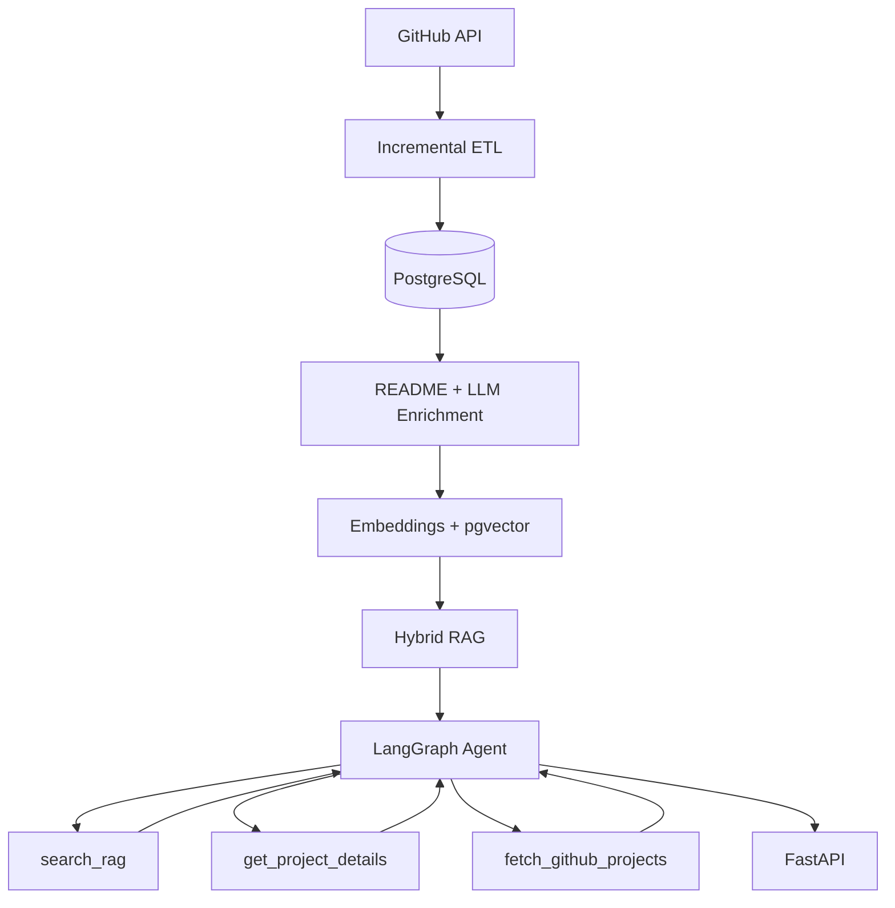

# Open Source Project Intelligence

An AI-powered system for discovering, processing, and understanding open-source GitHub projects.

This project demonstrates an end-to-end workflow combining Data Engineering, AI Engineering, and Production Engineering, from GitHub data ingestion to an AI-powered RAG agent deployed on AWS.

## Overview

The system collects GitHub repository data, processes it through an incremental ETL pipeline, enriches projects using an LLM, and makes the resulting knowledge searchable through hybrid RAG and an AI agent.

The application is containerized with Docker, orchestrated with Airflow, tested through GitHub Actions, and automatically deployed to AWS EC2.
```text
GitHub API
    ↓
Incremental Ingestion
    ↓
ETL + Validation
    ↓
PostgreSQL
    ↓
README Ingestion
    ↓
LLM Enrichment
    ↓
Embeddings + pgvector
    ↓
Hybrid RAG
    ↓
LangGraph Agent + Tools
    ↓
FastAPI
    ↓
Docker + AWS
```

## Architecture



## Features
### Data Engineering

- GitHub REST API ingestion
- Incremental data processing
- ETL and data transformation
- Data validation and quality checks
- Duplicate detection
- PostgreSQL data modeling
- README ingestion
- Airflow pipeline orchestration

### AI Engineering

- Local LLM-based project enrichment
- Structured LLM output with Pydantic
- Text chunking and embeddings
- Vector search with pgvector
- Hybrid RAG retrieval
- LangGraph agent
- Tool-based agent workflow

### Production Engineering

- FastAPI
- Docker + Docker Compose
- GitHub Actions CI/CD
- Automated testing
- AWS EC2 deployment
- AWS Secrets Manager + IAM

## Tech Stack

| Area | Technologies |
|---|---|
| Language | Python |
| Database | PostgreSQL, pgvector |
| Data Pipeline | Python ETL, Apache Airflow |
| LLM | Ollama (local), OpenAI (cloud) |
| Embeddings | Sentence Transformers |
| RAG | pgvector, hybrid retrieval |
| Agent | LangGraph |
| API | FastAPI |
| Testing | pytest |
| Containerization | Docker, Docker Compose |
| CI | GitHub Actions |
| Data Source | GitHub REST API |
| Cloud | AWS EC2, Secrets Manager, IAM |

---
## Data Pipeline

The pipeline is designed to avoid processing unchanged repositories repeatedly.

```text
GitHub Repositories
        ↓
Check github_id
        ↓
New or Updated?
   ┌────┴────┐
  Yes        No
   ↓          ↓
Process      Skip
   ↓
Transform
   ↓
Validate
   ↓
PostgreSQL
```

For existing repositories, the pipeline compares the GitHub `updated_at` timestamp with the database record.

This allows the system to focus processing on **new or changed projects** instead of rebuilding the entire dataset every time.

---

## RAG

The project uses **pgvector** for semantic retrieval.

The retrieval process combines:

- Project metadata
- README content
- LLM-generated enrichment
- Vector similarity
- Keyword matching

Example queries:

```text
Which projects are related to AI agents?
```

or:

```text
Find projects for building visual AI agent workflows.
```

---

## AI Agent

The agent has three main tools:

- search_rag — search existing project knowledge
- get_project_details — retrieve project details
- fetch_github_projects — fetch additional GitHub data

For example:

```text
User Question
      ↓
    Agent
      ↓
Search existing knowledge
      ↓
Enough information?
   ┌────┴────┐
  Yes        No
   ↓          ↓
Answer    Fetch more GitHub data
              ↓
            Answer
```

---

## Workflow Orchestration

Airflow is used to orchestrate the data pipeline.

The current workflow includes:

```text
Fetch GitHub Data
        ↓
Incremental Filter
        ↓
Transform
        ↓
Validate
        ↓
Load PostgreSQL
        ↓
Ingest README
        ↓
AI Enrichment
        ↓
Create Embeddings
```

This separates individual pipeline stages and makes the workflow easier to monitor and manage.

---

## Testing

The project uses pytest for unit and PostgreSQL integration tests.

GitHub Actions automatically runs tests and validates the Docker build.

Pull Requests are required to pass CI before merging into main.

---
## CI/CD
```text
dev
 ↓
Pull Request
 ↓
CI
 ↓
main
 ↓
GitHub Actions
 ↓
AWS EC2
 ↓
Docker Compose
```
---
## AWS Deployment
The production environment contains:
```text
AWS EC2
├── FastAPI
├── Airflow Webserver
├── Airflow Scheduler
└── PostgreSQL + pgvector
```
### Live API
[Swagger Docs](http://13.211.54.105:8000/docs)
---
## API

Run locally:

```bash
uvicorn src.api.main:app --reload
```

Interactive API documentation:

```text
http://localhost:8000/docs
```


## Evaluation
### Initial RAG Evaluation

The initial evaluation uses 5 manually curated queries.

| Metric | Score |
|---|---:|
| Hit@1 | 0.80 |
| Hit@3 | 1.00 |
| Hit@5 | 1.00 |
| MRR | 0.867 |

### Agent Evaluation
- Queries: 4
- Tool Accuracy: 0.75

Tested tool routing:
- search_rag
- get_project_details
- fetch_github_projects

The evaluation also tests multi-tool routing and GitHub
search parameters such as sorting and result limits.

The evaluation datasets will be expanded in future iterations.

---

## Future Improvements

- Improved RAG evaluation
- More comprehensive Agent evaluation
- Larger automated test suite
- Improved retrieval quality
- Frontend interface