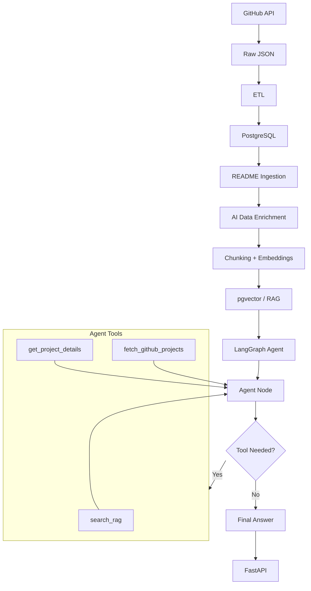

# Open Source Project Intelligence

An AI-powered system for discovering, processing, and understanding open-source GitHub projects.

This project demonstrates an end-to-end workflow that combines Data Engineering, AI Engineering, and Production Engineering.

## Overview

The system collects GitHub repository data, processes and validates it through an incremental data pipeline, enriches projects using a local LLM, and makes the data searchable through RAG and an AI agent.

The project is designed to demonstrate how raw external data can be transformed into a usable AI-powered application.

GitHub API
    ↓
Incremental Ingestion
    ↓
ETL + Data Validation
    ↓
PostgreSQL
    ↓
README Ingestion
    ↓
LLM Enrichment
    ↓
Embeddings + pgvector
    ↓
Hybrid RAG
    ↓
AI Agent + Tools
    ↓
FastAPI
    ↓
Docker + CI
    ↓
AWS

## Architecture



## Features
### Data Engineering

- GitHub REST API ingestion
- Incremental data processing
- ETL and data transformation
- Data validation and quality checks
- Duplicate detection
- PostgreSQL data modeling
- README ingestion
- Airflow pipeline orchestration

### AI Engineering

- Local LLM-based project enrichment
- Structured LLM output with Pydantic
- Text chunking and embeddings
- Vector search with pgvector
- Hybrid RAG retrieval
- LangGraph agent
- Tool-based agent workflow

### Production Engineering

- FastAPI application
- Dockerized application
- Dockerized Airflow
- PostgreSQL container
- GitHub Actions CI
- Automated pytest execution
- Docker image build validation
- Pull Request CI
- Protected `main` branch with required CI checks

## Tech Stack

| Area | Technologies |
|---|---|
| Language | Python |
| Database | PostgreSQL, pgvector |
| Data Pipeline | Python ETL, Airflow |
| LLM | Ollama, Qwen2.5 |
| Embeddings | Sentence Transformers |
| RAG | pgvector, hybrid retrieval |
| Agent | LangGraph |
| API | FastAPI |
| Testing | pytest |
| Containerization | Docker, Docker Compose |
| CI | GitHub Actions |
| Data Source | GitHub REST API |
| Cloud | AWS |

---
## Data Pipeline

The pipeline is designed to avoid processing unchanged repositories repeatedly.

```text
GitHub Repositories
        ↓
Check github_id
        ↓
New or Updated?
   ┌────┴────┐
  Yes        No
   ↓          ↓
Process      Skip
   ↓
Transform
   ↓
Validate
   ↓
PostgreSQL
```
For existing repositories, the pipeline compares the GitHub `updated_at` timestamp with the database record.

This allows the system to focus processing on **new or changed projects** instead of rebuilding the entire dataset every time.

---

## Database

The project uses PostgreSQL with pgvector.

The database stores:

- GitHub project metadata
- Topics
- README content
- LLM enrichment
- Text chunks
- Embeddings

The database schema can be initialized with:

```bash
psql -f database/schema.sql
```

---

## API

Start the API locally:

```bash
uvicorn src.api.main:app --reload
```

Open the interactive API documentation:

```text
http://localhost:8000/docs
```

Example request:

```json
{
  "query": "Which projects are related to AI agents?"
}
```

Example response:

```json
{
  "answer": "Several projects in the knowledge base are related to AI agents..."
}
```


## Evaluation
### Initial RAG Evaluation

The initial evaluation uses 5 manually curated queries.

| Metric | Score |
|---|---:|
| Hit@1 | 0.80 |
| Hit@3 | 1.00 |
| Hit@5 | 1.00 |
| MRR | 0.867 |

### Agent Evaluation
- Queries: 4
- Tool Accuracy: 0.75

Tested tool routing:
- search_rag
- get_project_details
- fetch_github_projects

The evaluation also tests multi-tool routing and GitHub
search parameters such as sorting and result limits.

The evaluation datasets will be expanded in future iterations.

---

## Project Status

### V1 — AI + Data Pipeline

Completed.

- GitHub ingestion
- ETL
- PostgreSQL
- AI enrichment
- pgvector RAG
- LangGraph agent
- FastAPI

### V2 — Production Engineering

Completed so far:

- Incremental pipeline
- Data quality improvements
- Airflow orchestration
- Docker
- GitHub Actions CI
- PostgreSQL integration tests
- Docker build validation
- Pull Request CI
- Branch protection

### Next

- AWS fundamentals
- AWS deployment
- Production data pipeline improvements
- More automated testing
- Monitoring and reliability improvements

---

## Future Improvements

- AWS deployment
- RAG evaluation
- Agent evaluation
- More comprehensive automated tests
- Improved retrieval quality
- Production monitoring
- Frontend interface